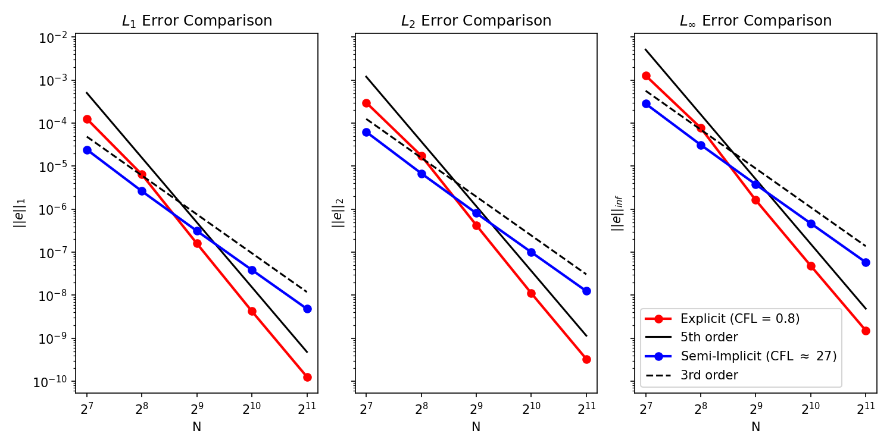

# SemiImplicitFV

A finite volume solver for the compressible Euler equations on rectilinear meshes in 1D, 2D, and 3D. Supports explicit (SSP Runge-Kutta) and semi-implicit (pressure-split) time integration, high-order WENO and upwind reconstruction, multiple Riemann solvers, and Information Geometric Regularization (IGR). Output is in VTK format for visualization with ParaView.

## Features

- **Explicit and semi-implicit time integration** — SSP-RK1/2/3 for explicit; advective CFL with implicit pressure correction for semi-implicit (Kwatra et al.)
- **High-order spatial reconstruction** — WENO and upwind schemes at 1st, 3rd, and 5th order
- **Riemann solvers** — Lax-Friedrichs, Rusanov, and HLLC
- **Equations of state** — Ideal gas and stiffened gas
- **N-phase compressible flow** — Volume-fraction-based multi-phase model with per-phase stiffened gas EOS, Wood's mixture sound speed, and mixture Riemann solvers
- **Viscosity** — Newtonian viscous stress tensor with Stokes hypothesis; per-phase viscosity via arithmetic mixture rule for multi-phase flows
- **Body forces** — Time-dependent gravitational / body force acceleration per dimension
- **Surface tension** — Capillary stress tensor (Schmidmayer et al. 2017) with CSF interface force
- **Information Geometric Regularization (IGR)** — Entropic pressure via elliptic solve for improved stability
- **1D / 2D / 3D** on rectilinear (uniform) meshes with ghost cells
- **Boundary conditions** — Periodic, Reflective, Outflow, Slip Wall, No-Slip Wall
- **MPI parallelism** — Cartesian domain decomposition with non-blocking halo exchange
- **VTK output** — `.vtr` (serial), `.pvtr` (parallel), and `.pvd` (time series) for ParaView

## Convergence

The 1D advection test case (Gaussian density pulse on a periodic domain, WENO5 + RK3) demonstrates the expected convergence rates for both solvers across grid resolutions from 128 to 2048 cells:



- **Explicit solver** (red, CFL = 0.8): 5th-order convergence in all norms, matching the WENO5 spatial accuracy
- **Semi-implicit solver** (blue, effective CFL ~ 27): 3rd-order convergence, limited by the RK3 time integrator but with substantially larger time steps

## Quick Start

```bash
# Build
mkdir build && cd build
cmake .. -DCMAKE_BUILD_TYPE=Release
make -j

# Run the Sod shock tube example
cd ../examples/1D_sod_shocktube
../../build/1D_sod_shocktube
```

Or use the convenience script:

```bash
./run_case.sh 1D_sod_shocktube
```

Output VTK files are written to a `VTK/` directory inside the example folder. Open the `.pvd` file in [ParaView](https://www.paraview.org/) to visualize the results.

## Building

### Requirements

- CMake 3.14+
- C++17 compiler
- MPI implementation (e.g., Open MPI, MPICH)
- OpenMP (optional)

### CMake Options

| Option | Default | Description |
|---|---|---|
| `BUILD_EXAMPLES` | `ON` | Build example programs in `examples/` |
| `BUILD_TESTS` | `OFF` | Build tests |
| `ENABLE_OPENMP` | `OFF` | Enable OpenMP support |

MPI is always required and linked automatically.

```bash
mkdir build && cd build

# Release build (default)
cmake .. -DCMAKE_BUILD_TYPE=Release
make -j

# Debug build (enables AddressSanitizer automatically)
cmake .. -DCMAKE_BUILD_TYPE=Debug
make -j
```

### Using `run_case.sh`

The `run_case.sh` script handles configuring, building, and running any example:

```bash
./run_case.sh 1D_sod_shocktube              # Build and run (1 MPI rank)
./run_case.sh --debug 1D_advection           # Debug build
./run_case.sh -n 4 1D_sod_shocktube         # Run with 4 MPI ranks
./run_case.sh --build-only 2D_riemann        # Build without running
./run_case.sh --list                         # List available cases
```

## Configuration

All simulation parameters are set through the `SimulationConfig` struct (defined in `include/SimulationConfig.hpp`). Key settings:

```cpp
SimulationConfig config;
config.dim = 2;                              // Spatial dimensions (1, 2, or 3)
config.nGhost = 3;                           // Ghost cells (must match reconstruction order)
config.RKOrder = 3;                          // Runge-Kutta order (1, 2, or 3)
config.reconOrder = ReconstructionOrder::WENO5;  // Reconstruction scheme
config.semiImplicit = false;                 // Use semi-implicit solver
config.useIGR = true;                        // Enable IGR

// Explicit solver parameters
config.explicitParams.cfl = 0.6;
config.explicitParams.maxDt = 1e-3;

// Semi-implicit solver parameters
config.semiImplicitParams.cfl = 0.8;
config.semiImplicitParams.maxPressureIters = 1000;
config.semiImplicitParams.pressureTol = 1e-6;

// IGR parameters
config.igrParams.alphaCoeff = 10.0;
config.igrParams.IGRIters = 5;
```

The `validate()` method checks consistency (e.g., ghost cell count matches reconstruction stencil, semi-implicit requires RK order 1).

### Multi-Phase Configuration

Enable N-phase flow by setting `multiPhaseParams` in the config. Each phase has its own stiffened gas EOS parameters (`gamma` and `pInf`). Set `pInf = 0` for ideal gas phases.

```cpp
// Two-phase setup: water (stiffened gas) + air (ideal gas)
config.multiPhaseParams.nPhases = 2;
config.multiPhaseParams.phases = {
    {4.4, 6.0e8},   // Phase 0 (water): gamma = 4.4, pInf = 6e8 Pa
    {1.4, 0.0}      // Phase 1 (air):   gamma = 1.4, pInf = 0
};
config.multiPhaseParams.alphaMin = 1e-8;     // Minimum volume fraction clamp
```

Volume fractions (`alpha[k]`) are tracked for phases 0 through `nPhases - 2`; the last phase fraction is `1 - sum(alpha[k])`. The solver uses Wood's mixture sound speed at cell centers and an equivalent single-fluid formula at reconstructed faces.

### Viscosity

Enable Newtonian viscous fluxes by setting a non-zero dynamic viscosity:

```cpp
config.viscousParams.mu = 1.81e-5;  // dynamic viscosity in Pa·s (0 = inviscid)
```

The viscous stress tensor uses the Stokes hypothesis: `tau_ij = mu * (du_i/dx_j + du_j/dx_i) - (2/3) * mu * div(u) * delta_ij`. Viscous work (`tau . u`) is included in the energy equation.

#### Per-Phase Viscosity

For multi-phase problems where each fluid has a different viscosity, set `phaseMu` instead of the scalar `mu`. The vector must have one entry per phase, matching the order in `multiPhaseParams.phases`:

```cpp
// Per-phase viscosity: water (phase 0) and air (phase 1)
config.viscousParams.phaseMu = {1.0e-3, 1.81e-5};  // Pa·s per phase
```

The effective viscosity at each cell face is computed on-the-fly using an arithmetic volume-fraction-weighted mixture rule:

```
mu_cell = sum_k( alpha_k * mu_k )
mu_face = 0.5 * ( mu_left + mu_right )
```

When `phaseMu` is set, the scalar `mu` field is ignored. When `phaseMu` is empty (the default), the scalar `mu` is used uniformly. This avoids allocating a viscosity array equal to the problem size.

### Body Forces

Apply time-dependent body forces with a per-dimension acceleration of the form `a(t) = a + b * cos(c * t + d)`:

```cpp
// Constant gravity in the y-direction
config.bodyForceParams.a = {0.0, -9.81, 0.0};

// Oscillating force in the x-direction: 5.0 * cos(2*pi*t)
config.bodyForceParams.a = {0.0, 0.0, 0.0};
config.bodyForceParams.b = {5.0, 0.0, 0.0};
config.bodyForceParams.c = {2.0 * M_PI, 0.0, 0.0};
```

### Surface Tension

Enable surface tension for multi-phase simulations. The capillary stress tensor (Schmidmayer et al. 2017) is:

`T_cap = sigma * ( |grad(alpha)| I - grad(alpha) x grad(alpha) / |grad(alpha)| )`

whose divergence recovers the classical Continuum Surface Force (CSF): `div(T_cap) = sigma * kappa * grad(alpha)`.

```cpp
config.surfaceTensionParams.sigma = 0.0728;        // surface tension coefficient in N/m
config.surfaceTensionParams.epsGradAlpha = 1e-8;    // regularization for |grad(alpha)|
```

### Reconstruction Orders

| Scheme | Order | Ghost Cells Required |
|---|---|---|
| `WENO1` / `UPWIND1` | 1st | 1 |
| `WENO3` / `UPWIND3` | 3rd | 2 |
| `WENO5` / `UPWIND5` | 5th | 3 |

WENO schemes include nonlinear shock-capturing weights. Upwind schemes use standard polynomial reconstruction.

## Writing a New Problem

Each example is a standalone `.cpp` file in its own subdirectory under `examples/`. CMake automatically discovers and builds them. To add a new case:

1. Create `examples/my_case/my_case.cpp`
2. Set up a `SimulationConfig` and create a mesh via `Runtime`
3. Choose an EOS, Riemann solver, and (optionally) IGR and pressure solvers
4. Attach the solver to the runtime and set initial/boundary conditions
5. Run the time loop

### Single-Phase Example

```cpp
#include "Runtime.hpp"
#include "IdealGasEOS.hpp"
#include "HLLCSolver.hpp"
#include "ExplicitSolver.hpp"
#include "VTKSession.hpp"

using namespace SemiImplicitFV;

int main(int argc, char* argv[]) {
    Runtime runtime(argc, argv);

    SimulationConfig config;
    config.dim = 1;
    config.nGhost = 3;
    config.RKOrder = 3;
    config.reconOrder = ReconstructionOrder::WENO5;
    config.explicitParams.cfl = 0.6;

    auto mesh = runtime.createUniformMesh(100, 0.0, 1.0, config);
    runtime.setBoundaryCondition(Face::XLow, BoundaryCondition::Outflow);
    runtime.setBoundaryCondition(Face::XHigh, BoundaryCondition::Outflow);

    auto eos = std::make_shared<IdealGasEOS>(1.4, 287.0);
    auto riemann = std::make_shared<HLLCSolver>(eos, config);
    auto solver = std::make_shared<ExplicitSolver>(mesh, riemann, eos, nullptr, config);
    runtime.attachSolver(solver);

    SolutionState state;
    state.allocate(mesh);

    // Set initial conditions...
    // for (int i = 0; i < mesh.totalCells(); ++i) { ... }

    state.convertPrimitiveToConservativeVariables(mesh, *eos);

    VTKSession vtk("my_case", "VTK");
    double t = 0.0, tEnd = 0.2, dtOut = 0.01;
    double nextOut = 0.0;

    while (t < tEnd) {
        if (t >= nextOut) {
            vtk.write(mesh, state, t);
            nextOut += dtOut;
        }
        double dt = solver->step(config, mesh, state, tEnd - t);
        t += dt;
    }
    vtk.finalize();
    return 0;
}
```

### Multi-Phase Example

Multi-phase problems require additional initialization of per-phase volume fractions (`alpha`) and partial densities (`alphaRho`). The `MixtureEOS` namespace provides the mixture total energy function. A fallback single-phase EOS is still needed for the solver constructor.

```cpp
#include "Runtime.hpp"
#include "IdealGasEOS.hpp"
#include "MixtureEOS.hpp"
#include "LFSolver.hpp"
#include "ExplicitSolver.hpp"
#include "VTKSession.hpp"
#include "RKTimeStepping.hpp"

using namespace SemiImplicitFV;

int main(int argc, char** argv) {
    Runtime rt(argc, argv);

    SimulationConfig config;
    config.dim = 1;
    config.nGhost = 4;
    config.RKOrder = 3;
    config.reconOrder = ReconstructionOrder::WENO5;
    config.explicitParams.cfl = 0.5;

    // Two-phase stiffened-gas setup
    config.multiPhaseParams.nPhases = 2;
    config.multiPhaseParams.phases = {{4.4, 6.0e8}, {1.4, 0.0}};
    config.multiPhaseParams.alphaMin = 1e-8;

    config.validate();

    RectilinearMesh mesh = rt.createUniformMesh(config, 500, 0.0, 1.0);
    rt.setBoundaryCondition(mesh, RectilinearMesh::XLow,  BoundaryCondition::Outflow);
    rt.setBoundaryCondition(mesh, RectilinearMesh::XHigh, BoundaryCondition::Outflow);

    SolutionState state;
    state.allocate(mesh.totalCells(), config);

    auto& mp = config.multiPhaseParams;
    double alphaMin = mp.alphaMin;

    for (int i = 0; i < mesh.nx(); ++i) {
        std::size_t idx = mesh.index(i, 0, 0);
        double x = mesh.cellCentroidX(i);

        double rho, p, alphaWater;
        if (x < 0.7) {
            rho = 1000.0; p = 1.0e9; alphaWater = 1.0 - alphaMin;
        } else {
            rho = 50.0;   p = 1.0e5; alphaWater = alphaMin;
        }
        double alphaAir = 1.0 - alphaWater;

        state.alphaRho[0][idx] = alphaWater * rho;
        state.alphaRho[1][idx] = alphaAir * rho;
        state.alpha[0][idx] = alphaWater;
        state.rho[idx] = rho;
        state.pres[idx] = p;
        state.velU[idx] = 0.0;

        std::vector<double> alphas = {alphaWater};
        state.rhoE[idx] = MixtureEOS::mixtureTotalEnergy(rho, p, alphas, 0.0, mp);
    }

    auto eos = std::make_shared<IdealGasEOS>(1.4, 287.0, config);
    auto riemann = std::make_shared<LFSolver>(eos, config);
    ExplicitSolver solver(mesh, riemann, eos, nullptr, config);
    rt.attachSolver(solver, mesh);

    VTKSession vtk(rt, "my_multiphase_case", mesh);
    auto stepFn = [&](double targetDt) {
        return solver.step(config, mesh, state, targetDt);
    };
    runTimeLoop(rt, config, mesh, state, vtk, stepFn,
                {.endTime = 2.4e-4, .outputInterval = 1.2e-5, .printInterval = 50});

    return 0;
}
```

Key differences from single-phase:
- Set `config.multiPhaseParams` with phase count, per-phase `{gamma, pInf}`, and `alphaMin`
- Call `state.allocate(mesh.totalCells(), config)` (the config overload allocates `alpha` and `alphaRho` arrays)
- Initialize `state.alpha[k]`, `state.alphaRho[k]` for each phase, and compute `state.rhoE` via `MixtureEOS::mixtureTotalEnergy()`
- The solver automatically detects multi-phase mode from the config and uses mixture EOS routines for reconstruction, Riemann solving, and time stepping

Rebuild, and the new executable appears automatically:

```bash
./run_case.sh my_case
```

### Multi-Phase Viscous Example

The `2D_rising_bubble` example demonstrates a full multi-phase viscous setup with gravity and surface tension (Hysing et al. 2009, Test Case 2). The key configuration pattern for combining multi-phase with per-phase viscosity, body forces, and surface tension:

```cpp
// Two-phase EOS: heavy surrounding fluid + light bubble
config.multiPhaseParams.nPhases  = 2;
config.multiPhaseParams.phases   = {{6.12, 3.43e8}, {1.4, 0.0}};
config.multiPhaseParams.alphaMin = 1e-8;

// Per-phase viscosity (phase 0 = heavy, phase 1 = light)
config.viscousParams.phaseMu = {10.0, 0.1};     // Pa·s

// Gravity
config.bodyForceParams.a[1] = -9.81;

// Surface tension
config.surfaceTensionParams.sigma = 1.96;        // N/m
```

When initializing the solution state, set the volume fractions and partial densities per cell. The mixture EOS computes total energy from the local phase composition:

```cpp
SolutionState state;
state.allocate(mesh.totalCells(), config);

for (int j = 0; j < mesh.ny(); ++j) {
    for (int i = 0; i < mesh.nx(); ++i) {
        std::size_t idx = mesh.index(i, j, 0);
        // ... compute alphaHeavy from interface geometry ...

        state.alpha[0][idx]    = alphaHeavy;              // phase 0 volume fraction
        state.alphaRho[0][idx] = alphaHeavy * rhoHeavy;   // phase 0 partial density
        state.alphaRho[1][idx] = (1.0 - alphaHeavy) * rhoLight;
        state.rho[idx]         = state.alphaRho[0][idx] + state.alphaRho[1][idx];

        state.pres[idx] = p;
        std::vector<double> alphas = {alphaHeavy};
        state.rhoE[idx] = MixtureEOS::mixtureTotalEnergy(
            state.rho[idx], p, alphas, 0.0, config.multiPhaseParams);
    }
}
```

No viscosity array is allocated — the viscous flux routine evaluates `mu = sum(alpha_k * mu_k)` at each face directly from the volume fractions stored in the solution state.

## MPI Execution

MPI is always linked. Run with `mpirun`:

```bash
mpirun -np 4 ./build/2D_riemann
```

Or via the helper script:

```bash
./run_case.sh -n 4 2D_riemann
```

The `Runtime` class handles domain decomposition, halo exchange, and parallel VTK output automatically. Each rank writes its own `.vtr` piece file, and rank 0 writes the `.pvtr` and `.pvd` metadata files.

## Project Structure

```
SemiImplicitFV/
├── include/               Header files
│   ├── SimulationConfig.hpp   Configuration struct
│   ├── SolutionState.hpp      Field data storage
│   ├── RectilinearMesh.hpp    Mesh with ghost cells
│   ├── ExplicitSolver.hpp     SSP-RK explicit solver
│   ├── SemiImplicitSolver.hpp Pressure-split semi-implicit solver
│   ├── RiemannSolver.hpp      Abstract Riemann solver interface
│   ├── LFSolver.hpp           Lax-Friedrichs
│   ├── RusanovSolver.hpp      Rusanov
│   ├── HLLCSolver.hpp         HLLC
│   ├── Reconstruction.hpp     WENO/upwind reconstruction
│   ├── IGR.hpp                Information Geometric Regularization
│   ├── EquationOfState.hpp    Abstract EOS interface
│   ├── IdealGasEOS.hpp        Ideal gas EOS
│   ├── StiffenedGasEOS.hpp    Stiffened gas EOS
│   ├── MixtureEOS.hpp         N-phase mixture EOS routines
│   ├── ViscousFlux.hpp        Newtonian viscous stress
│   ├── SurfaceTension.hpp     Capillary stress tensor
│   ├── PressureSolver.hpp     Abstract pressure solver
│   ├── Runtime.hpp            MPI/serial runtime abstraction
│   ├── MPIContext.hpp         MPI domain decomposition
│   ├── HaloExchange.hpp       MPI ghost cell communication
│   ├── VTKWriter.hpp          VTK file I/O
│   └── VTKSession.hpp         VTK time-series management
├── src/                   Implementation files
├── examples/              Example problems
│   ├── 1D_advection/
│   ├── 1D_sod_shocktube/
│   ├── 1D_gas_gas_shocktube/       Two-phase ideal gas shock tube
│   ├── 1D_liquid_gas_shocktube/    Water-air stiffened gas shock tube
│   ├── 1D_hydrostatic_water/       Hydrostatic column with gravity
│   ├── 2D_channel_flow/            Viscous Poiseuille flow
│   ├── 2D_isentropic_vortex/
│   ├── 2D_laplace_pressure_jump/   Droplet with surface tension
│   ├── 2D_quasi1D_sod/
│   ├── 2D_riemann/
│   └── 2D_rising_bubble/         Multi-phase viscous bubble with surface tension
├── CMakeLists.txt
└── run_case.sh            Build & run helper script
```

## Visualization

Output files are VTK XML RectilinearGrid format, viewable in [ParaView](https://www.paraview.org/):

1. Open the `.pvd` file in ParaView to load the full time series
2. Apply a color map to fields like `Density`, `Pressure`, or `Velocity`
3. Use the animation controls to step through time

Fields written per cell: density, velocity (u, v, w), momentum, pressure, temperature, total energy, and entropic pressure (sigma). Multi-phase simulations additionally write per-phase volume fractions (`Alpha_0`, `Alpha_1`, ...) and partial densities (`AlphaRho_0`, `AlphaRho_1`, ...).

## License

See [LICENSE](LICENSE) for details.
