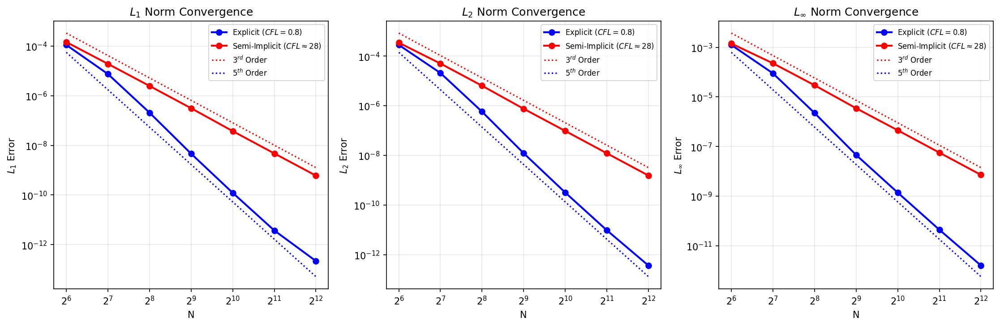

# SemiImplicitFV

A finite volume solver for the compressible Euler equations on rectilinear meshes in 1D, 2D, and 3D. Supports explicit (SSP Runge-Kutta) and semi-implicit (pressure-split) time integration, high-order WENO and upwind reconstruction, multiple Riemann solvers, and Information Geometric Regularization (IGR). Output is in VTK format for visualization with ParaView.

## Features

- **Explicit and semi-implicit time integration** — SSP-RK1/2/3 for explicit; advective CFL with implicit pressure correction for semi-implicit (Kwatra et al.)
- **High-order spatial reconstruction** — WENO and upwind schemes at 1st, 3rd, and 5th order
- **Riemann solvers** — Lax-Friedrichs, Rusanov, and HLLC
- **Equations of state** — Ideal gas and stiffened gas
- **N-phase compressible flow** — Volume-fraction-based multi-phase model with per-phase stiffened gas EOS, Wood's mixture sound speed, and mixture Riemann solvers
- **Viscosity** — Newtonian viscous stress tensor with Stokes hypothesis; per-phase viscosity via arithmetic mixture rule for multi-phase flows
- **Body forces** — Time-dependent gravitational / body force acceleration per dimension
- **Surface tension** — Capillary stress tensor (Schmidmayer et al. 2017) with CSF interface force
- **Immersed boundary method** — Ghost-cell IBM with circle, rectangle, cylinder, and rectangular prism body types; slip and no-slip walls
- **Information Geometric Regularization (IGR)** — Entropic pressure via elliptic solve for improved stability
- **1D / 2D / 3D** on rectilinear (uniform) meshes with ghost cells
- **Boundary conditions** — Periodic, Reflective, Outflow, Slip Wall, No-Slip Wall
- **MPI parallelism** — Cartesian domain decomposition with non-blocking halo exchange
- **VTK output** — `.vtr` (serial), `.pvtr` (parallel), and `.pvd` (time series) for ParaView

## Convergence

The 1D advection test case (Gaussian density pulse on a periodic domain, WENO5 + RK3) demonstrates the expected convergence rates for both solvers across grid resolutions from 128 to 2048 cells:



- **Explicit solver** (red, CFL = 0.8): 5th-order convergence in all norms, matching the WENO5 spatial accuracy
- **Semi-implicit solver** (blue, effective CFL ~ 28): 3rd-order convergence, limited by the RK3 time integrator but with substantially larger time steps

## Quick Start

```bash
# Run the Sod shock tube (builds automatically on first run)
./run_case.sh 1D_sod_shocktube

# List all available cases
./run_case.sh --list
```

Output VTK files are written to a `VTK/` directory inside the case folder (e.g. `cases/1D_sod_shocktube/VTK/`). Open the `.pvd` file in [ParaView](https://www.paraview.org/) to visualize the results.

## Building and Running

The `run_case.sh` script handles configuring, building, and running automatically. There is no need to invoke CMake or Make directly.

```bash
./run_case.sh 1D_sod_shocktube              # Build and run (1 MPI rank)
./run_case.sh -n 4 2D_riemann               # Run with 4 MPI ranks
./run_case.sh --debug 1D_advection           # Debug build (enables AddressSanitizer)
./run_case.sh --build-only 2D_riemann        # Build without running
./run_case.sh --case-optimization 1D_sod     # Codegen: compile JSON into optimized C++
./run_case.sh --list                         # List available cases
```

### Requirements

- CMake 3.14+
- C++17 compiler
- MPI implementation (e.g., Open MPI, MPICH)

### Manual Build

If you prefer to build manually instead of using `run_case.sh`:

```bash
mkdir build && cd build
cmake .. -DCMAKE_BUILD_TYPE=Release
make -j
```

## Defining Cases (JSON Input)

Cases are defined as JSON files in `cases/<name>/<name>.jsonc`. This is the primary way to set up simulations — no C++ coding required. The `sifv` generic driver reads the JSON and runs the simulation.

### Minimal Example

```jsonc
{
    "config": {
        "dim": 1,
        "nGhost": 3,
        "RKOrder": 3,
        "reconOrder": "WENO5",
        "explicitParams": { "cfl": 0.6 }
    },
    "eos": { "type": "IdealGas", "gamma": 1.4, "R": 287.0 },
    "riemannSolver": "HLLC",
    "mesh": { "nx": 100, "xMin": 0.0, "xMax": 1.0 },
    "boundaryConditions": { "xLow": "Outflow", "xHigh": "Outflow" },
    "timeLoop": { "endTime": 0.2, "outputInterval": 0.01 },
    "output": { "baseName": "my_case" },
    "initialConditions": {
        "default": { "rho": 1.0, "u": 0.0, "p": 1.0 },
        "patches": [
            {
                "geometry": { "type": "plane", "point": [0.5, 0, 0], "normal": [1, 0, 0] },
                "state": { "rho": 0.125, "p": 0.1 }
            }
        ]
    }
}
```

### JSON Schema Reference

**Top-level sections:**

| Section | Required | Description |
|---|---|---|
| `config` | Yes | Solver parameters (dim, RK order, CFL, etc.) |
| `eos` | No | Equation of state (`"IdealGas"` or `"StiffenedGas"`) |
| `riemannSolver` | No | `"LF"`, `"Rusanov"`, or `"HLLC"` (default) |
| `mesh` | Yes | Grid dimensions and extents |
| `boundaryConditions` | No | Per-face BC: `"Outflow"`, `"Periodic"`, `"Symmetry"`, `"SlipWall"`, `"NoSlipWall"` |
| `timeLoop` | Yes | End time, output interval, print interval |
| `output` | No | VTK base name and directory |
| `initialConditions` | Yes | Default state and geometry-based patches |
| `immersedBoundaries` | No | Immersed boundary bodies (explicit solver only) |
| `smoothing` | No | Post-initialization field smoothing iterations |

**Initial condition patches** support `"box"`, `"sphere"`, `"plane"`, and `"analytic"` geometry types. Patch states inherit from the default state — only specify fields that differ.

### Immersed Boundaries

Add solid bodies to the domain using the ghost-cell immersed boundary method. Supported with the explicit solver only.

```jsonc
"immersedBoundaries": {
    "bodies": [
        {
            "type": "circle",              // "circle", "rectangle", "cylinder", "rectangularPrism"
            "center": [1.0, 1.0],          // 2D: [x,y], 3D: [x,y,z]
            "radius": 0.2,                 // circle/cylinder only
            "wallType": "NoSlip"           // "NoSlip" (default) or "Slip"
        }
    ]
}
```

Body types:
- **`circle`** — 2D circle: `center` (2 values), `radius`
- **`rectangle`** — 2D axis-aligned rectangle: `center` (2 values), `halfWidths` (2 values)
- **`cylinder`** — 3D infinite cylinder: `center` (2 values in cross-section plane), `radius`, `axis` (0=x, 1=y, 2=z, default 2)
- **`rectangularPrism`** — 3D axis-aligned box: `center` (3 values), `halfWidths` (3 values)

### Code Generation (Case Optimization)

For maximum performance, the `--case-optimization` flag generates a standalone C++ `main()` from the JSON with all parameters hardcoded as compile-time constants:

```bash
./run_case.sh --case-optimization 1D_sod_shocktube
```

This eliminates runtime parsing overhead and enables the compiler to optimize aggressively.

## Configuration Reference

All simulation parameters are set through `SimulationConfig` (defined in `include/SimulationConfig.hpp`). In JSON cases, these appear under the `"config"` section. In compiled C++ cases, they are set directly on the struct.

### Config Fields

| Field | Default | Description |
|---|---|---|
| `dim` | 1 | Spatial dimensions (1, 2, or 3) |
| `nGhost` | 3 | Ghost cells (must match reconstruction order) |
| `RKOrder` | 1 | Runge-Kutta order (1, 2, or 3) |
| `reconOrder` | `"WENO1"` | Reconstruction scheme |
| `semiImplicit` | false | Use semi-implicit solver |
| `useIGR` | false | Enable IGR |
| `wenoEps` | 1e-6 | WENO smoothness parameter |

### Explicit Solver Parameters (`explicitParams`)

| Field | Description |
|---|---|
| `cfl` | CFL number (acoustic) |
| `constDt` | Fixed time step (0 = adaptive) |
| `maxDt` | Maximum time step |
| `minDt` | Minimum time step |

### Semi-Implicit Solver Parameters (`semiImplicitParams`)

| Field | Description |
|---|---|
| `cfl` | CFL number (advective) |
| `maxDt` / `minDt` | Time step bounds |
| `maxPressureIters` | Max pressure Poisson iterations |
| `pressureTol` | Pressure solve convergence tolerance |

### Multi-Phase Configuration (`multiPhaseParams`)

Enable N-phase flow with per-phase stiffened gas EOS. Set `pInf = 0` for ideal gas phases.

```jsonc
"multiPhaseParams": {
    "nPhases": 2,
    "phases": [
        { "gamma": 4.4, "pInf": 6.0e8 },
        { "gamma": 1.4, "pInf": 0.0 }
    ],
    "alphaMin": 1e-8
}
```

### Viscosity (`viscousParams`)

```jsonc
"viscousParams": {
    "mu": 1.81e-5,
    "phaseMu": [1.0e-3, 1.81e-5]
}
```

Set `mu` for uniform viscosity or `phaseMu` for per-phase viscosity (multi-phase only). When `phaseMu` is set, the scalar `mu` is ignored.

### Body Forces (`bodyForceParams`)

Per-dimension acceleration of the form `a(t) = a + b * cos(c * t + d)`:

```jsonc
"bodyForceParams": {
    "a": [0.0, -9.81, 0.0]
}
```

### Surface Tension (`surfaceTensionParams`)

Capillary stress tensor (Schmidmayer et al. 2017) for multi-phase flows:

```jsonc
"surfaceTensionParams": {
    "sigma": 0.0728,
    "epsGradAlpha": 1e-8
}
```

### IGR Parameters (`igrParams`)

| Field | Description |
|---|---|
| `alphaCoeff` | Regularization coefficient |
| `IGRIters` | Gauss-Seidel iterations per step |
| `IGRWarmStartIters` | Warm-start iterations at t=0 |

### Reconstruction Orders

| Scheme | Order | Ghost Cells Required |
|---|---|---|
| `WENO1` / `UPWIND1` | 1st | 1 |
| `WENO3` / `UPWIND3` | 3rd | 2 |
| `WENO5` / `UPWIND5` | 5th | 3 |

WENO schemes include nonlinear shock-capturing weights. Upwind schemes use standard polynomial reconstruction.

## Writing Compiled Cases (C++)

For cases requiring custom post-processing, diagnostics, or logic not expressible in JSON, you can write a standalone C++ source file. Place it in `cases/<name>/<name>.cpp` (generated `.cpp` files in `cases/` are git-ignored).

Use `--compiled` to build and run a compiled case:

```bash
./run_case.sh --compiled 2D_flow_over_circle
```

## MPI Execution

Run with multiple MPI ranks using the `-n` flag:

```bash
./run_case.sh -n 4 2D_riemann
```

The `Runtime` class handles domain decomposition, halo exchange, and parallel VTK output automatically. Each rank writes its own `.vtr` piece file, and rank 0 writes the `.pvtr` and `.pvd` metadata files.

## Project Structure

```
SemiImplicitFV/
├── cases/                 Case definitions (JSON input files)
│   ├── 1D_advection/
│   ├── 1D_sod_shocktube/
│   ├── 1D_gas_gas_shocktube/
│   ├── 1D_liquid_gas_shocktube/
│   ├── 1D_hydrostatic_water/
│   ├── 2D_channel_flow/
│   ├── 2D_flow_over_circle/      IBM: flow past a circular body
│   ├── 2D_isentropic_vortex/
│   ├── 2D_laplace_pressure_jump/
│   ├── 2D_quasi1D_sod/
│   ├── 2D_riemann/
│   └── 2D_rising_bubble/
├── driver/                Generic JSON driver (sifv)
├── include/               Header files
├── src/                   Library source files
├── tools/                 Code generation and utilities
│   └── codegen.py         JSON → optimized C++ source generator
├── CMakeLists.txt
└── run_case.sh            Build & run helper script
```

## Visualization

Output files are VTK XML RectilinearGrid format, viewable in [ParaView](https://www.paraview.org/):

1. Open the `.pvd` file in ParaView to load the full time series
2. Apply a color map to fields like `Density`, `Pressure`, or `Velocity`
3. Use the animation controls to step through time

Fields written per cell: density, velocity (u, v, w), momentum, pressure, temperature, total energy, and entropic pressure (sigma). Multi-phase simulations additionally write per-phase volume fractions (`Alpha_0`, `Alpha_1`, ...) and partial densities (`AlphaRho_0`, `AlphaRho_1`, ...).

## License

See [LICENSE](LICENSE) for details.
